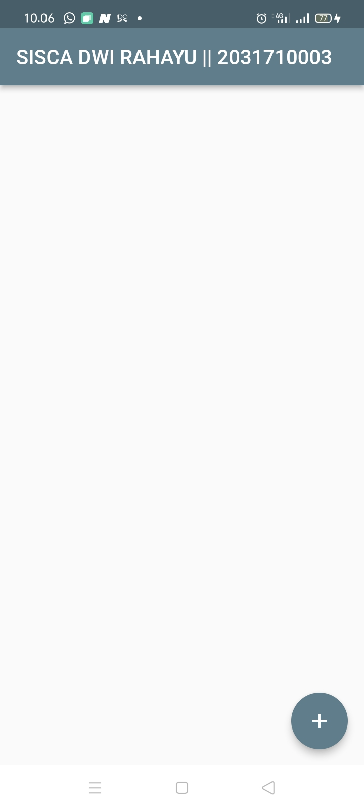
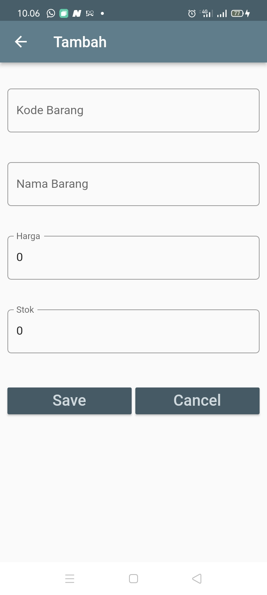
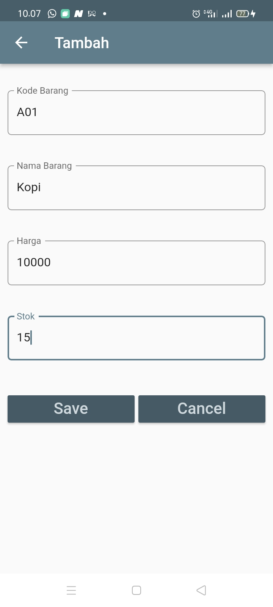
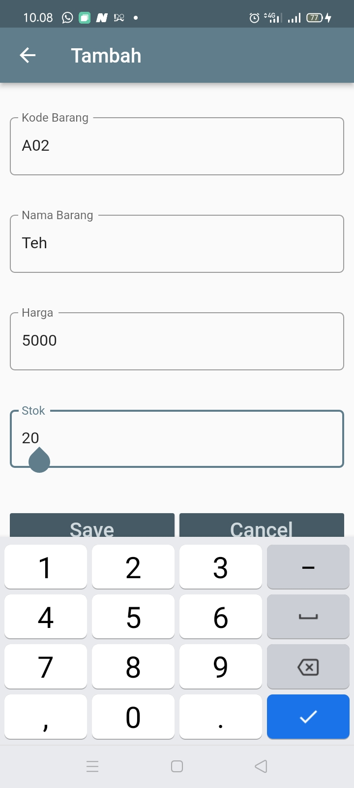
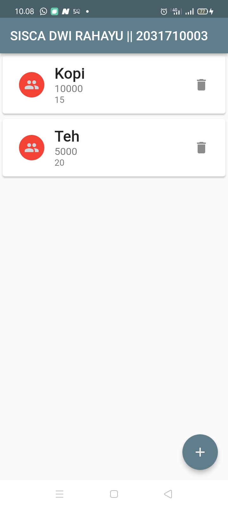
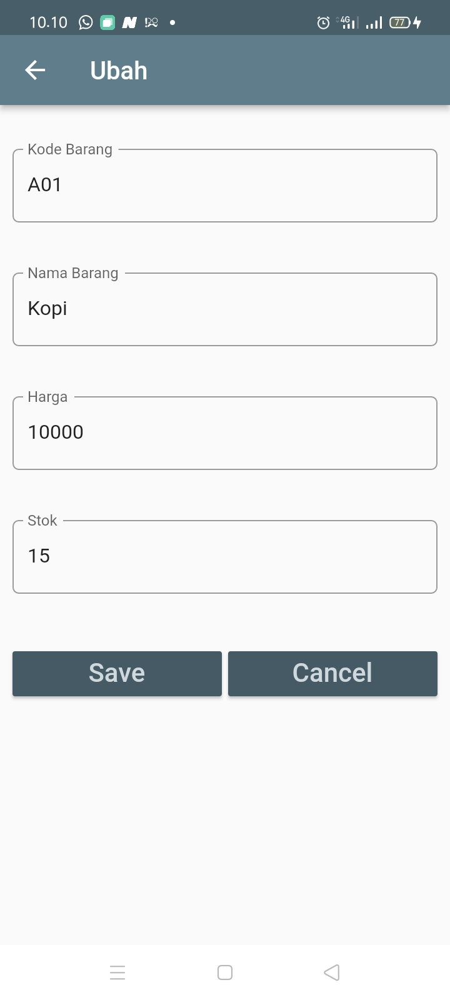
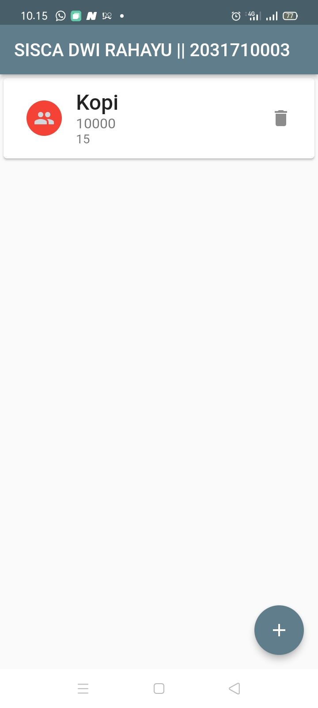

# Jobsheet 6 Pemrograman Mobile (DB SQLITE)

Nama : Sisca Dwi Rahayu  
NIM : 2031710003  
Kelas : MI-2C  
Prodi : D3 Manajemen Informatika  

# Screenshoot Hasil Praktikum
## Halaman Daftar Item

## Halaman Tambah Item

## Isi Data

## Isi Data

## Halaman Daftar Item Setelah Mengisi Data Item

## Ketika Item di klik maka akan dapat melakukan ubah item

## Ketika ikon hapus pada teh di klik maka item teh akan terhapus
